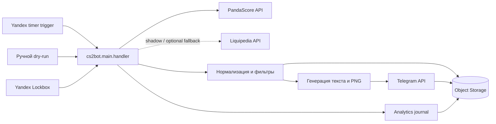

# Архитектура CS2 Results Bot

Документ описывает устойчивые границы системы. Поля моделей, правила fallback и
ключи дедупликации подробно зафиксированы в `data-contract.md`; параметры запуска
и deploy — в `../README.md` и `yandex-cloud-deploy.md`.

## Общая схема

## Компоненты

| Компонент | Ответственность | Не должен делать |
|---|---|---|
| `cs2bot/main.py` | Разбор job, orchestration, каналы, Telegram-доставка, fallback на текст | Парсить ответы провайдеров |
| `cs2bot/match_sources/sources/` | HTTP-запросы и преобразование ответов провайдеров | Отправлять сообщения и выбирать каналы |
| `cs2bot/match_sources/models.py` | Нормализованные модели матчей, контекста и радара | Содержать transport-логику |
| `cs2bot/match_sources/filters.py` | Валидация, Tier-1 и upcoming-отбор | Хранить состояние доставки |
| `cs2bot/match_sources/match_fetcher.py` | Выбор источника, freshness gate, shadow-сравнение | Смешивать источники в одной выдаче |
| `cs2bot/match_sources/storage.py` | Claims, processed keys, cooldown и Object Storage | Решать, какой контент публиковать |
| `cs2bot/media_cards.py` | Детерминированный рендер PNG и безопасная загрузка логотипов | Выполнять Telegram-доставку |
| `cs2bot/analytics.py` | Запись событий постов, подписчиков и кампаний | Блокировать основную публикацию при своей ошибке |
| `cs2bot/social_oauth.py` | Отдельный OAuth handler для соцсетей и запись токенов в Lockbox | Участвовать в основном Telegram handler |

## Основной поток результатов

1. Trigger вызывает `cs2bot.main.handler` с `job=results` или `job=digest`.
2. Handler запрашивает нормализованные матчи через data-layer.
3. `match_fetcher` получает PandaScore, проверяет валидность и свежесть. Если
   включено, Liquipedia отдельно сравнивается в shadow-режиме.
4. Фильтры оставляют разрешённые матчи и применяют настройки канала.
5. Для каждой доставки создаётся атомарный claim в Object Storage.
6. Handler формирует текст и, если включено, PNG-карточку.
7. После подтверждённого Telegram API вызова claim фиксируется в состоянии
   `sent`, затем создаётся processed marker.
8. Если marker не успел записаться, следующий запуск восстанавливает его по
   состоянию `sent` без повторной публикации. При определённом отклонении
   Telegram claim освобождается; при неопределённом исходе он сохраняется для
   диагностики и алерта, без автоматического повтора.

## Поток расписания и контекста

1. `job=schedule` получает upcoming-матчи PandaScore в окне локального дня.
2. Upcoming-фильтр выбирает Tier-1 турниры и заметные матчи популярных команд.
3. Матчи сортируются хронологически и при необходимости разбиваются на две
   карточки.
4. Для ограниченного числа приоритетных матчей PandaScore context может добавить
   форму, размеры составов и подтверждённые очные встречи.
5. Сбой контекста не блокирует основное расписание.

## Поток турнирного радара

- `job=radar` получает standings, brackets, rosters и следующий матч через
  `pandascore_context.py`.
- Публикуются только подтверждённые данные; неполный ответ допускает частичный
  радар без выдуманных пар.
- Доставка дедуплицируется по турниру, дню и каналу.
- Production timer для радара пока не является частью основной схемы.

## Состояние и идемпотентность

Object Storage содержит три типа данных:

- `claims/` — временные leases для конкурентной доставки;
- `processed/` — завершённые per-channel публикации;
- analytics journal — append-only события продукта.

Канонический fingerprint не зависит от provider ID и порядка команд. Это
предотвращает повтор при переключении PandaScore ↔ Liquipedia. Условные записи
`If-None-Match` и `If-Match` защищают от параллельных invocation. Точные ключи и
правила совместимости описаны в `data-contract.md` и
`object-storage-lifecycle.md`.

## Конфигурация и секреты

- Несекретные правила отбора находятся в `tier1_filter.json`.
- Runtime-конфигурация читается из переменных окружения.
- Токены и ключи передаются через Yandex Lockbox и не хранятся в репозитории.
- `cs2bot/config.py` отвечает за Telegram и каналы;
  `cs2bot/match_sources/config.py` — за источники, фильтры, freshness и storage.
- Production-триггеры должны ссылаться на тег `production`.

## Границы отказов

- Невалидный или stale ответ источника не доходит до публикации.
- Shadow и analytics работают fail-open: их ошибка логируется, основной поток
  продолжается.
- Определённая ошибка изображения или Telegram API приводит к текстовому fallback;
  при сетевом сбое, HTTP 5xx или невалидном ответе Telegram fallback запрещён,
  чтобы не создать дубль.
- Успешная генерация контента без успешной Telegram-доставки не создаёт processed
  marker.
- Логи и диагностические ответы не должны содержать секреты.

## Куда вносить изменения

- Новый провайдер — `match_sources/sources/`, затем нормализация и контрактные
  тесты.
- Новое правило отбора — сначала `tier1_filter.json`; код фильтра меняется только
  если конфиг недостаточен.
- Новый тип публикации — orchestration в `main.py`, рендер отдельно в
  `media_cards.py`, отдельный content UID и дедупликация.
- Изменение модели — `models.py`, адаптеры источников, `data-contract.md` и тесты.
- Изменение delivery semantics — `storage.py`, `main.py`, lifecycle-документация и
  конкурентные тесты.
