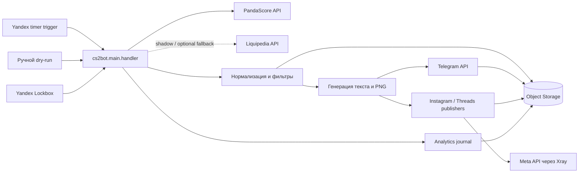

# Архитектура CS2 Results Bot

Документ описывает устойчивые границы системы. Поля моделей, правила fallback и
ключи дедупликации подробно зафиксированы в `data-contract.md`; параметры запуска
и deploy — в `../README.md` и `yandex-cloud-deploy.md`.

## Общая схема

## Компоненты

| Компонент | Ответственность | Не должен делать |
|---|---|---|
| `cs2bot/main.py` | Разбор job, orchestration, каналы, Telegram-доставка, fallback на текст | Парсить ответы провайдеров |
| `cs2bot/match_sources/sources/` | HTTP-запросы и преобразование ответов провайдеров | Отправлять сообщения и выбирать каналы |
| `cs2bot/match_sources/models.py` | Нормализованные модели матчей, контекста и радара | Содержать transport-логику |
| `cs2bot/match_sources/filters.py` | Валидация, Tier-1 и upcoming-отбор | Хранить состояние доставки |
| `cs2bot/match_sources/match_fetcher.py` | Выбор источника, freshness gate, shadow-сравнение | Смешивать источники в одной выдаче |
| `cs2bot/match_sources/storage.py` | Delivery state machine, outbox, processed keys, cooldown и Object Storage | Решать, какой контент публиковать |
| `cs2bot/media_cards.py` | Детерминированный рендер PNG и безопасная загрузка логотипов | Выполнять Telegram-доставку |
| `cs2bot/analytics.py` | Запись событий постов, подписчиков и кампаний | Блокировать основную публикацию при своей ошибке |
| `cs2bot/social_oauth.py` | Отдельный OAuth handler для соцсетей и запись токенов в Lockbox | Участвовать в основном Telegram handler |
| `cs2bot/instagram_publish.py`, `cs2bot/threads_publish.py` | Загрузка публичных карточек и вызовы Meta через Xray | Выбирать контент или разделять Telegram state |

## Основной поток результатов

1. Trigger вызывает `cs2bot.main.handler` с `job=results`.
2. Handler запрашивает нормализованные матчи через data-layer.
3. `match_fetcher` получает PandaScore, проверяет валидность и свежесть. Если
   включено, Liquipedia отдельно сравнивается в shadow-режиме.
4. Фильтры оставляют разрешённые матчи и применяют настройки канала.
5. Для каждой доставки сохраняется durable outbox item, затем создаётся атомарный
   claim в Object Storage.
6. Handler выбирает наименее недавно обрабатывавшиеся outbox items, формирует
   текст и, если сеть не находится в text-only режиме, PNG-карточку.
7. Непосредственно перед запросом к Telegram, Instagram или Threads claim
   атомарно переводится из `sending` в неперехватываемое состояние `attempting`.
8. После подтверждённого ответа платформы claim фиксируется в состоянии `sent`,
   затем создаётся processed marker.
9. После processed marker outbox item удаляется. Если marker не успел записаться,
   следующий запуск восстанавливает его по
   состоянию `sent` без повторной публикации. При определённом отклонении
   платформы claim освобождается; при неопределённом исходе он переходит в
   `uncertain`, сохраняется для диагностики и алерта и не повторяется
   автоматически. У неоднозначного результата outbox удаляется.
10. Отдельный `retry_only` trigger раз в пять минут обрабатывает только outbox и не
   расходует квоту PandaScore или Liquipedia shadow.

## Поток ежедневных выпусков и контекста

1. `job=schedule` получает upcoming-матчи PandaScore в окне локального дня.
2. После исключений qualifier, showmatch, academy, youth и junior в выпуск входят
   турниры PandaScore tier `S`/`A` либо матчи с
   `feature_reason=tier1_tournament`. Для результатов tier остаётся диагностикой:
   там действует отдельный строгий Tier-1 LAN-фильтр.
3. Матчи сортируются хронологически и при необходимости разбиваются на две
   карточки.
4. Для всех матчей расписания PandaScore context добавляет форму и подтверждённые
   очные встречи за последние три месяца; порядок остаётся приоритетным.
5. Сбой контекста не блокирует основное расписание.
6. `job=digest` отдельно получает завершённые матчи локального дня и применяет
   строгий Tier-1 LAN-фильтр. Расписание и digest используют ежедневные content
   claims для каждого канала и платформы, но не result outbox.

## Поток турнирного радара

- `job=radar` получает brackets, rosters и следующий матч через
  `pandascore_context.py`.
- Публикуются только подтверждённые данные; неполный ответ допускает частичный
  радар без выдуманных пар.
- `job=radar_discovery` ежедневно запрашивает все матчи следующего локального
  дня, выбирает Tier-1 турниры и вызывает радар по самому раннему матчу каждого
  турнира. Если PandaScore ещё не опубликовал подтверждённые пары сетки, выпуск
  пропускается.
- Доставка дедуплицируется по турниру, времени первого матча и каналу.

## Состояние и идемпотентность

Object Storage содержит дополнительные типы состояния доставки:

- `outbox/results/` — нормализованные результаты до подтверждённой публикации;
- `claims/` — состояния `sending`, `attempting`, `uncertain`, `sent` и `released`;
- `processed/` — завершённые per-channel публикации;
- `delivery-health/` — короткое окно адаптивного text-only режима;
- analytics journal — append-only события продукта.

Канонический fingerprint не зависит от provider ID и порядка команд. Это
предотвращает повтор при переключении PandaScore ↔ Liquipedia. Условные записи
`If-None-Match` и `If-Match` защищают от параллельных invocation. Точные ключи и
правила совместимости описаны в `data-contract.md` и
`object-storage-lifecycle.md`.

## Конфигурация и секреты

- Несекретные правила отбора находятся в `tier1_filter.json`.
- Runtime-конфигурация читается из переменных окружения.
- Токены и ключи передаются через Yandex Lockbox и не хранятся в репозитории.
- Отдельная OAuth-функция направляет запросы к Meta через `SOCIAL_PROXY_URL`,
  подключённый из Lockbox; запросы к Yandex Lockbox через этот прокси не идут.
- `cs2bot/config.py` отвечает за Telegram и каналы;
  `cs2bot/match_sources/config.py` — за источники, фильтры, freshness и storage.
- Production-триггеры должны ссылаться на тег `production`.

## Границы отказов

- Невалидный или stale ответ источника не доходит до публикации.
- Shadow и analytics работают fail-open: их ошибка логируется, основной поток
  продолжается.
- Определённая ошибка изображения приводит к текстовому fallback. Для результата
  Telegram PNG делает до двух попыток при `ConnectTimeout`, затем одна текстовая
  попытка выполняется в том же invocation и на час включается text-only режим.
  Если TCP-соединение не установилось и для текста, `attempting` безопасно
  переводится в `released`, а outbox ждёт следующий trigger. При остальных
  сетевых сбоях, HTTP 5xx или невалидном ответе claim остаётся неперехватываемым,
  а fallback запрещён, чтобы не создать дубль.
- Успешная генерация контента без успешной Telegram-доставки не создаёт processed
  marker.
- Логи и диагностические ответы не должны содержать секреты.

## Куда вносить изменения

- Новый провайдер — `match_sources/sources/`, затем нормализация и контрактные
  тесты.
- Новое правило отбора — сначала `tier1_filter.json`; код фильтра меняется только
  если конфиг недостаточен.
- Новый тип публикации — orchestration в `main.py`, рендер отдельно в
  `media_cards.py`, отдельный content UID и дедупликация.
- Изменение модели — `models.py`, адаптеры источников, `data-contract.md` и тесты.
- Изменение delivery semantics — `storage.py`, `main.py`, lifecycle-документация и
  конкурентные тесты.
