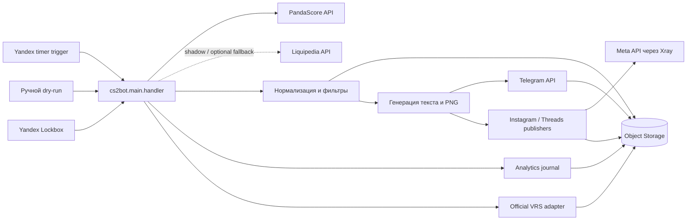

# Архитектура CS2 Results Bot

Документ описывает устойчивые границы системы. Поля моделей, правила fallback и
ключи дедупликации подробно зафиксированы в `data-contract.md`; параметры запуска
и deploy — в `../README.md` и `yandex-cloud-deploy.md`.

## Общая схема

```mermaid
flowchart LR
    T[Yandex timer trigger] --> H[cs2bot.main.handler]
    M[Ручной dry-run] --> H
    H --> P[PandaScore API]
    H -. shadow / optional fallback .-> L[Liquipedia API]
    H --> F[Нормализация и фильтры]
    F --> S[(Object Storage)]
    F --> C[Генерация текста и PNG]
    C --> G[Telegram API]
    C --> SP[Instagram / Threads publishers]
    SP --> Q[Meta API через Xray]
    G --> S
    SP --> S
    H --> A[Analytics journal]
    A --> S
    X[Yandex Lockbox] --> H
    H --> V[Official VRS adapter]
    V --> S
```

## Компоненты

| Компонент | Ответственность | Не должен делать |
|---|---|---|
| `cs2bot/main.py` | Разбор job, orchestration, каналы, Telegram-доставка, fallback на текст | Парсить ответы провайдеров |
| `cs2bot/match_sources/sources/` | HTTP-запросы и преобразование ответов провайдеров | Отправлять сообщения и выбирать каналы |
| `cs2bot/match_sources/models.py` | Нормализованные модели матчей, контекста и радара | Содержать transport-логику |
| `cs2bot/match_sources/filters.py` | Валидация, Tier-1 и upcoming-отбор | Хранить состояние доставки |
| `cs2bot/match_sources/match_fetcher.py` | Выбор источника, freshness gate, shadow-сравнение | Смешивать источники в одной выдаче |
| `cs2bot/match_sources/storage.py` | Delivery state machine, outbox, processed keys, cooldown и Object Storage | Решать, какой контент публиковать |
| `cs2bot/media_cards.py` | Детерминированный рендер PNG и безопасная загрузка логотипов | Выполнять Telegram-доставку |
| `cs2bot/match_sources/sources/vrs_source.py` | Получение и нормализация versioned VRS snapshots | Смешивать источники или публиковать неполные данные |
| `cs2bot/analytics.py` | Запись событий постов, подписчиков и кампаний | Блокировать основную публикацию при своей ошибке |
| `cs2bot/social_oauth.py` | Отдельный OAuth handler для соцсетей и запись токенов в Lockbox | Участвовать в основном Telegram handler |
| `cs2bot/instagram_publish.py`, `cs2bot/threads_publish.py` | Загрузка публичных карточек и вызовы Meta через Xray | Выбирать контент или разделять Telegram state |

Preview-поток независим от выбора источника матчей:
`tournament_preview_job.py` → `tournament_preview_source.py` → проверенный
`TournamentPreview` → `tournament_preview_cards.py` → начальный VRS → независимые Telegram,
Instagram и Threads claims/publishers. `main.py` маршрутизирует `tournament_preview`
и `preview_discovery`, предоставляет сохранение VRS и существующие delivery-helper.
Профили связывают Liquipedia page и PandaScore serie
явно; `tournament_identity.py` связывает page, serie и проверенные stage ID
единым ключом розыгрыша для VRS и Threads. Начальный VRS сохраняется один раз
условным create до доставки анонса; при ошибке анонс ждёт повтора.
Внешние API не получают publishing-прав.

`tournament_branding.py` валидирует bundled JSON-реестр тем отдельно от
publication-профилей и разрешает явный ключ темы, затем точные ключи
события/серии/организатора. Полученные параметры сохраняются в preview snapshot;
явные значения профиля имеют приоритет, неизвестный ключ оставляет fallback.
`tournament_theme_patterns.py` рисует согласованные фоновые мотивы только для
анонсов. Discovery по-прежнему читает только одобренные профили: визуальный
реестр не является календарём или списком разрешённых публикаций.

`tournament_visuals.py` объединяет цвет, загрузку локального логотипа и спокойное
фоновое свечение анонса, финала и итогов. Оформление финала выбирается по точному
профилю матча при рендере; для итогов handler передаёт тот же `branding` в
Telegram и общий путь Instagram/Threads. Нормализованные результаты, claims и
маршруты публикаций от оформления не зависят. Подробности:
[`tournament-preview.md`](tournament-preview.md). В production включено 2 октября:
discovery ежедневно в 18:00 МСК, прежний радар PAUSED. Meta использует public media buckets,
Lockbox и Xray; job передаёт context издателям, не читая токены самостоятельно.

Выпущенная итерация 3 октября добавляет `branding_for_matches` для целых страниц
расписания/дайджеста и передаёт точный `branding` в VRS Telegram/Instagram/Threads.
Шапка использует bundled mark прежде URL источника. Контекстная обложка больше
не зависит от иллюстрации. Reel повторно использует готовые растры сцен:
карточки плавно появляются в начале, прогресс меняется на 12 кадрах/с;
FFmpeg сохраняет итоговые 24 fps. Доставка, источники и радар не изменяются.
Reel использует `ReelVisualContext`: exact event join,
палитра и локальный/ограниченно скачанный mark кэшируются до рендера сцен.
Тема единая только для полного однородного выпуска; смешанный день имеет
нейтральную шапку и оформление каждого матча. `context_matches` не участвует
в подсчёте, публикации или изменении порядка. `add_event_watermark` допускает
позицию/размер для вертикального формата; defaults статических карточек прежние.
`reel_delivery.next_reel_audio_style` читает все страницы существующего prefix
`reels/`, выбирает последний предыдущий контейнер и противоположный бит.
Новый `audio_style` сохраняется тем же conditional PUT, что контейнер:
first writer wins; повтор не запускает выбор/рендер. Legacy-записи без поля
остаются читаемыми. Состояния claims и порядок внешней публикации не меняются.

## Основной поток результатов

1. Trigger вызывает `cs2bot.main.handler` с `job=results`.
2. Handler запрашивает нормализованные матчи через data-layer.
3. `match_fetcher` получает PandaScore, проверяет валидность и свежесть. Если
   включено, Liquipedia отдельно сравнивается в shadow-режиме.
4. Фильтры оставляют разрешённые матчи и применяют настройки канала.
5. Для каждой доставки сохраняется durable outbox item, затем создаётся атомарный
   claim в Object Storage.
6. Handler выбирает наименее недавно обрабатывавшиеся outbox items, формирует
   текст и, если сеть не находится в text-only режиме, PNG-карточку.
7. Непосредственно перед запросом к Telegram, Instagram или Threads claim
   атомарно переводится из `sending` в неперехватываемое состояние `attempting`.
8. После подтверждённого ответа платформы claim фиксируется в состоянии `sent`,
   затем создаётся processed marker.
9. После processed marker outbox item удаляется. Если marker не успел записаться,
   следующий запуск восстанавливает его по
   состоянию `sent` без повторной публикации. При определённом отклонении
   платформы claim освобождается; при неопределённом исходе он переходит в
   `uncertain`, сохраняется для диагностики и алерта и не повторяется
   автоматически. У неоднозначного результата outbox удаляется.
10. Отдельный `retry_only` trigger раз в пять минут обрабатывает только outbox и не
    расходует квоту PandaScore или Liquipedia shadow.

Threads ведёт отдельную цепочку для каждого турнира. Для событий из preview-реестра
корень — анонс; радар, расписание, результаты, итоги дня/турнира и VRS продолжают
его через подтверждённый tail. До подтверждения анонса они не создают другой
корень; результаты остаются в outbox. При append Object Storage атомарно
резервирует цепочку и возвращает подтверждённый tail ID; неопределённый исход
блокирует только цепочку этого турнира. После ручной проверки tail оператор может
вызвать `restore_threads_chain_tail` и продолжить публикации.
Расписание и digest разделяются по турнирам; один Threads carousel содержит
страницы только одного турнира. Исторические профили сохраняют точную связь
PandaScore/Liquipedia независимо от давности review. Для событий без профиля
прежний ключ включает источник, и финал Liquipedia может открыть отдельную цепочку.

## Поток ежедневных выпусков и контекста

1. `job=schedule` получает upcoming-матчи PandaScore в окне локального дня.
2. После исключений qualifier, showmatch, academy, youth и junior в выпуск входят
   турниры PandaScore tier `S`/`A` либо матчи с
   `feature_reason=tier1_tournament`. Для результатов tier остаётся диагностикой:
   там действует отдельный строгий Tier-1 LAN-фильтр.
3. Матчи сортируются хронологически и разбиваются до четырёх на страницу;
   альбом содержит не более десяти PNG. При множестве чередующихся турниров
   сохраняются порядок и подпись турнира на каждой строке.
4. Для всех матчей расписания PandaScore context добавляет форму и подтверждённые
   очные встречи за последние три месяца; порядок остаётся приоритетным.
5. Telegram сначала получает карточки расписания (либо текст при отключённых
   карточках или безопасном fallback). После подтверждения основной публикации
   claim фиксируется как `sent`, затем отправляются отдельные обложки и сообщения
   контекста. Сбой контекста не вызывает повтор расписания; контекст никогда не
   подставляется вместо основной карточки или её подписи.
6. `job=digest` отдельно получает завершённые матчи локального дня и применяет
   строгий Tier-1 LAN-фильтр. Расписание и digest используют ежедневные content
   claims для каждого канала и платформы, но не result outbox.

Production с 2 октября 2026 использует `render_results_cards()`:
дайджест передаёт все страницы одним Telegram-альбомом с сохранением спойлера,
а Instagram и Threads получают весь список карточек. Одностраничные функции
явно отклоняют переполненную страницу. Версия релиза: `PROJECT_STATUS.md`.

Согласованная production-шапка использует общий `_draw_channel_brand()` из
`media_cards.py`: центрированная эмблема и название под ней. Он применяется
к обычным PNG, финалу, контексту и `_base()` всех Reel-сцен; `_card_header()`
задаёт общую последовательность типа, турнира и даты квадратных карточек.

## Поток турнирного радара

- `job=radar` получает brackets, rosters и следующий матч через
  `pandascore_context.py`.
- Публикуются только подтверждённые данные; неполный ответ допускает частичный
  радар без выдуманных пар.
- `job=radar_discovery` ежедневно запрашивает все матчи следующего локального
  дня, выбирает Tier-1 турниры и вызывает радар по самому раннему матчу каждого
  турнира. Если PandaScore ещё не опубликовал подтверждённые пары сетки, выпуск
  пропускается.
- Доставка дедуплицируется по турниру, времени первого матча и каналу.

## Состояние и идемпотентность

Object Storage содержит дополнительные типы состояния доставки:

- `outbox/results/` — нормализованные результаты до подтверждённой публикации;
- `claims/` — состояния `sending`, `attempting`, `uncertain`, `sent` и `released`;
- `processed/` — завершённые per-channel публикации;
- `threads/chains/` — подтверждённый tail, reservation и состояние блокировки
  отдельной цепочки турнира;
- `delivery-health/` — короткое окно адаптивного text-only режима;
- analytics journal — append-only события продукта.

Канонический fingerprint не зависит от provider ID и порядка команд. Это
предотвращает повтор при переключении PandaScore ↔ Liquipedia. Условные записи
`If-None-Match` и `If-Match` защищают от параллельных invocation. Точные ключи и
правила совместимости описаны в `data-contract.md` и
`object-storage-lifecycle.md`.

## Конфигурация и секреты

- Несекретные правила отбора находятся в `tier1_filter.json`.
- Runtime-конфигурация читается из переменных окружения.
- Токены и ключи передаются через Yandex Lockbox и не хранятся в репозитории.
- Отдельная OAuth-функция направляет запросы к Meta через `SOCIAL_PROXY_URL`,
  подключённый из Lockbox; запросы к Yandex Lockbox через этот прокси не идут.
- `cs2bot/config.py` отвечает за Telegram и каналы;
  `cs2bot/match_sources/config.py` — за источники, фильтры, freshness и storage.
- Production-триггеры должны ссылаться на тег `production`.

## Границы отказов

- Невалидный или stale ответ источника не доходит до публикации.
- Shadow и analytics работают fail-open: их ошибка логируется, основной поток
  продолжается.
- Определённая ошибка изображения приводит к текстовому fallback. Для результата
  Telegram PNG делает до двух попыток при `ConnectTimeout`, затем одна текстовая
  попытка выполняется в том же invocation и на час включается text-only режим.
  Если TCP-соединение не установилось и для текста, `attempting` безопасно
  переводится в `released`, а outbox ждёт следующий trigger. При остальных
  сетевых сбоях, HTTP 5xx или невалидном ответе claim остаётся неперехватываемым,
  а fallback запрещён, чтобы не создать дубль.
- Успешная генерация контента без успешной Telegram-доставки не создаёт processed
  marker.
- Логи и диагностические ответы не должны содержать секреты.

## Куда вносить изменения

- Новый провайдер — `match_sources/sources/`, затем нормализация и контрактные
  тесты.
- Новое правило отбора — сначала `tier1_filter.json`; код фильтра меняется только
  если конфиг недостаточен.
- Новый тип публикации — orchestration в `main.py`, рендер отдельно в
  `media_cards.py`, отдельный content UID и дедупликация.
- Изменение модели — `models.py`, адаптеры источников, `data-contract.md` и тесты.
- Изменение delivery semantics — `storage.py`, `main.py`, lifecycle-документация и
  конкурентные тесты.
